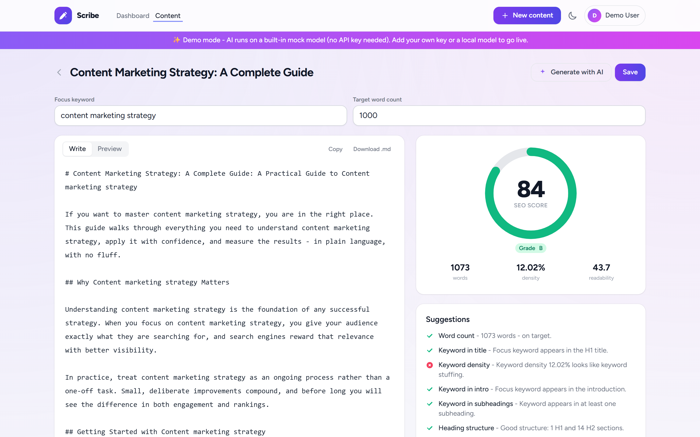
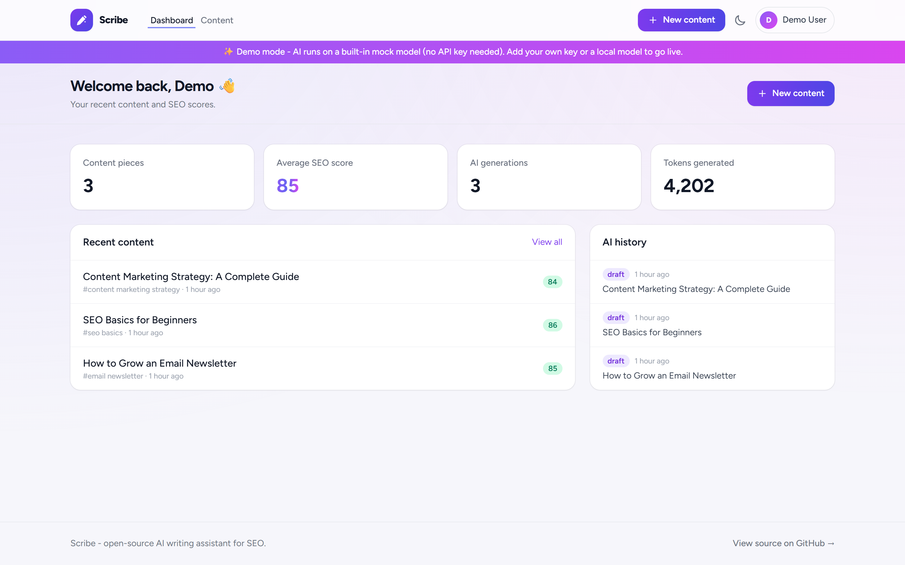
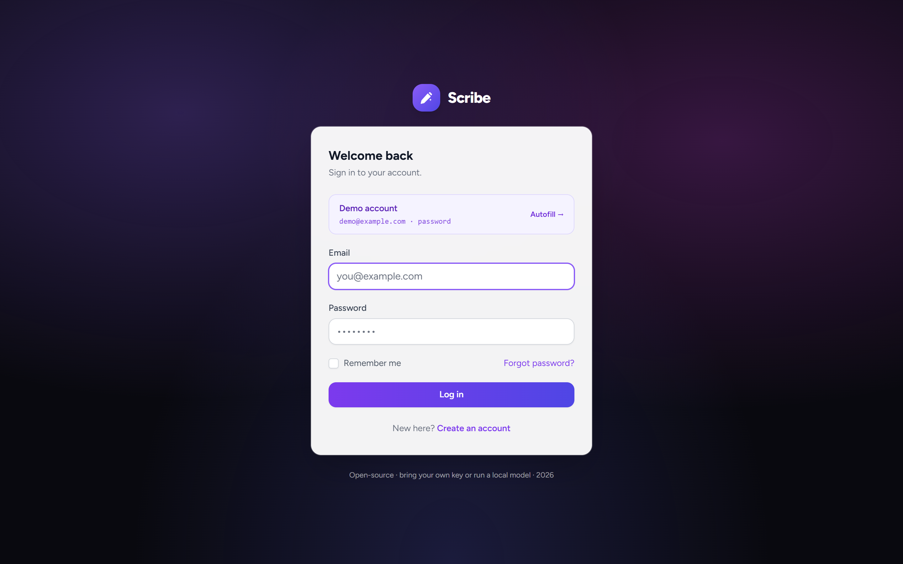
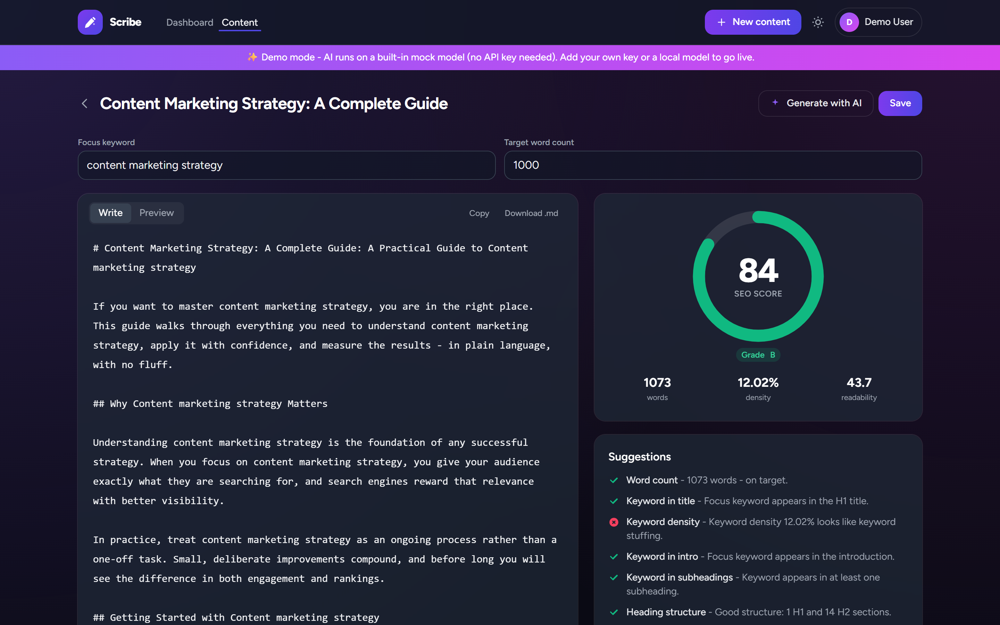

# Scribe - AI SEO Writing Assistant

> Generate a draft from a keyword and see a live SEO score as you edit. Open-source, self-hosted, and works with OpenAI, Anthropic, or a local model. No API key needed to try it.

Scribe is a writing editor with a built-in SEO score. You pick a topic and focus keyword, generate an outline or draft with the LLM of your choice, and the right-hand panel scores the text in real time (keyword usage, headings, readability, meta tags, length) with specific things to fix.

It runs in demo mode out of the box using a built-in mock model, so `docker compose up` gets you a working app without configuring anything.

Stack: Laravel 12, Tailwind CSS, Blade + Alpine.js.

---

## Features

- 🤖 Outline and draft generation from a topic/keyword.
- 🔌 Swappable LLM provider - OpenAI, Anthropic, or local Ollama - behind one interface. Set it with one env var; falls back to a mock model when no key is configured.
- 📊 Live SEO score: keyword density, keyword in title/intro/headings, heading structure, Flesch readability, meta title/description length, and word count vs target, each with a tip.
- ✍️ Split-screen editor: markdown on the left, score and suggestions on the right.
- 💾 Save and manage content pieces, with a generation history.
- Light/dark mode.
- Self-hosted, MIT-licensed. Your content and keys stay on your server.

---

## Screenshots



| Dashboard | Sign in |
| --- | --- |
|  |  |

<details>
<summary>Dark mode</summary>



</details>

---

## Quick start

Needs Docker (Desktop, or Engine + Compose v2).

```bash
git clone https://github.com/your-org/scribe.git
cd scribe
cp .env.example .env
docker compose up
```

Open http://localhost:8000 and sign in:

- Email: `demo@example.com`
- Password: `password`

With `DEMO_MODE=true` (the default), generation uses a mock model and the app is seeded with sample content, so it works without an API key. Change the demo credentials in `.env` before putting this anywhere public.

---

## Using your own model

Set `DEMO_MODE=false` in `.env` and pick a provider.

OpenAI (or any OpenAI-compatible endpoint):

```env
LLM_PROVIDER=openai
OPENAI_API_KEY=sk-...
OPENAI_MODEL=gpt-4o-mini
```

Anthropic:

```env
LLM_PROVIDER=anthropic
ANTHROPIC_API_KEY=sk-ant-...
ANTHROPIC_MODEL=claude-haiku-4-5
```

Local model with Ollama (no key, runs on your machine):

```bash
docker compose --profile ollama up -d
docker compose exec ollama ollama pull llama3.1
```

```env
LLM_PROVIDER=ollama
OLLAMA_BASE_URL=http://ollama:11434
OLLAMA_MODEL=llama3.1
```

Keys are read from the environment only.

---

## How it works

```
Browser (Blade + Alpine + Tailwind)
  - debounced POST /score  -> SeoAnalyzer -> live gauge
  - POST /generate         -> queued GenerateContentJob
        |
LlmManager -> LlmProvider (interface)
                OpenAiProvider     (Chat Completions)
                AnthropicProvider  (Messages API)
                OllamaProvider     (local /api/chat)
                MockProvider       (demo / tests, no network)
```

- `app/LLM/` holds the provider interface, the four providers, and `LlmManager`, which reads the active provider from config and falls back to the mock when no key is set.
- `app/Seo/` holds the scoring code (`SeoAnalyzer` plus `Readability`, `Keywords`, `Headings`). It has no framework dependencies, so it's straightforward to test.
- `app/Jobs/GenerateContentJob` runs generation on the queue; the editor polls for the result.

Because everything goes through the `LlmProvider` interface, adding a provider is a single class.

---

## Tests

```bash
docker compose exec app php artisan test
```

Tests use an in-memory SQLite database and the mock provider, so they don't call a real API. The scoring code and the provider layer (with faked HTTP) are covered.

---

## License

[MIT](LICENSE).
